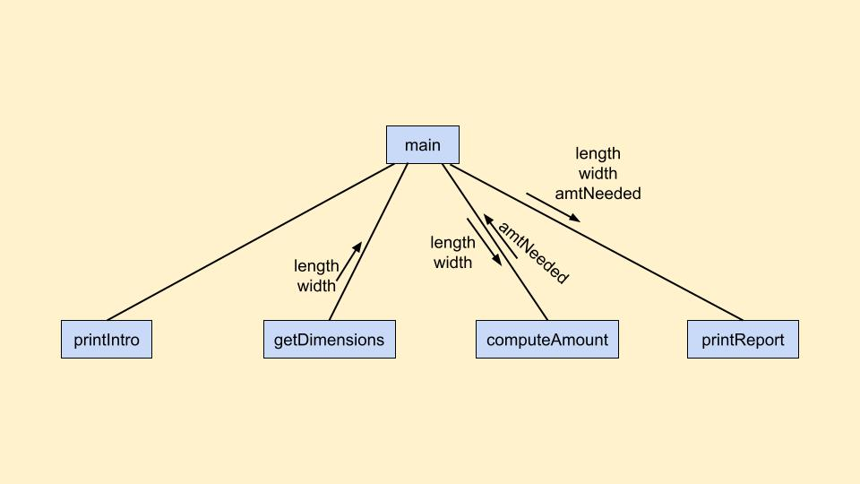

# Chapter 9 - Review Questions

## True/False

1. False. They can generate _pseudo-random numbers_.
2. False. It returns a float random number between 0 (included) and 1 (not included). `randint` returns a random integer.
3. True.
4. True.
5. True.
6. False.
7. True.
8. False.
9. False.
10. False.

## Multiple Choice

1. c.
2. c.
3. d.
4. a.
5. c.
6. a.
7. b.
8. a.
9. c.
10. b.

## Discussion

1. Top levels:

2. Usage of `random` and `randrange`:

	a) `randrange(11)`

	b) `random() - 0.5`

	c) `randrange(1, 7)`

	d) `randrange(1, 7) + randrange(1, 7)`

	e) `20*random() - 10`

3. One factor that can lead a to spiral development is the complexity of the specificacion for the program. When the program gets too big or too complicated to use a design like top-down, a spiral development technique might be a better approach.